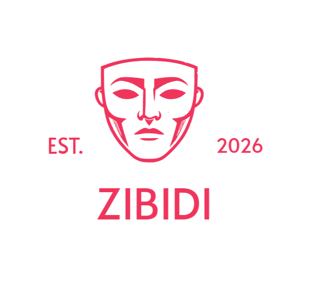

<div align="center">



# Zibidi

**A calm, iOS-inspired blog — read, post, and comment with clarity.**

Minimal surfaces, soft motion, slide-in panels instead of heavy modals, and typography that breathes.

<br />

[](https://zibidi.vercel.app)
[](https://nextjs.org/)
[](https://www.typescriptlang.org/)
[](https://supabase.com/)
[](https://tailwindcss.com/)

<br />

[Repository](https://github.com/Boreas44/Zibidi) · [Deploy guide](./VERCEL_DEPLOY.md) · [Issues](https://github.com/Boreas44/Zibidi/issues)

</div>

---

## Design language

Zibidi is built around an **Apple-like UI philosophy**:

| Principle | In practice |
|-----------|-------------|
| **Clarity** | Generous whitespace, readable type scale, muted secondary text |
| **Depth** | Subtle shadows, `backdrop-blur`, ambient gradients — never noisy |
| **Motion** | Smooth transitions; slide-in drawers from the right (or bottom on mobile) |
| **Touch-first** | Rounded iOS-style inputs, tab bar, full-width primary actions |
| **Focus** | Auth, create post, comments, and profile live in panels — not center modals |

The codebase is **TypeScript-only** (`.ts` / `.tsx`). Compiled output lives in `.next/` at build time — you will not see hand-written `.js` sources in the repo.

---

## Features

- **Feed & explore** — category filters, search, bookmarks
- **Posts** — create, like, delete (owner); read-time and excerpts
- **Comments** — threaded panel per post, live count sync
- **Profiles** — display name, bio, avatar upload; **unique nicknames** (case-insensitive)
- **Author display** — post and comment names always resolve from the live **Account** profile
- **Auth** — email + password, **6-digit OTP** signup, password reset, show/hide password fields
- **Email** — branded HTML templates (MailerSend / custom SMTP ready)

---

## Quick start

```bash
git clone https://github.com/Boreas44/Zibidi.git
cd Zibidi
npm install
cp .env.example .env.local   # fill Supabase keys
npm run dev
```

Open **[http://localhost:3000](http://localhost:3000)**.

### Environment

| Variable | Description |
|----------|-------------|
| `NEXT_PUBLIC_SUPABASE_URL` | Project URL (`*.supabase.co`) |
| `NEXT_PUBLIC_SUPABASE_ANON_KEY` | Anon public key |
| `NEXT_PUBLIC_SITE_URL` | Optional locally (`http://localhost:3000`); **required on Vercel** for auth emails |

---

## Supabase setup

Run migrations **in order** in the Supabase SQL Editor:

| # | File | Purpose |
|---|------|---------|
| 1 | [`001_posts.sql`](./supabase/migrations/001_posts.sql) | Posts table + RLS |
| 2 | [`003_auth_profiles.sql`](./supabase/migrations/003_auth_profiles.sql) | Profiles + auth-linked posts |
| 3 | [`004_avatars_storage.sql`](./supabase/migrations/004_avatars_storage.sql) | Avatar storage (optional) |
| 4 | [`005_comments.sql`](./supabase/migrations/005_comments.sql) | Comments + count trigger |
| 5 | [`006_unique_display_names_sync.sql`](./supabase/migrations/006_unique_display_names_sync.sql) | Unique display names + author sync |
| 6 | [`007_post_reactions.sql`](./supabase/migrations/007_post_reactions.sql) | Persistent likes / dislikes |
| 7 | [`008_replies_realtime.sql`](./supabase/migrations/008_replies_realtime.sql) | Nested replies + Supabase Realtime |

**Authentication → URL configuration**

| Setting | Local | Production |
|---------|-------|------------|
| Site URL | `http://localhost:3000` | `https://zibidi.vercel.app` |
| Redirect URLs | `http://localhost:3000/auth/callback` | `https://zibidi.vercel.app/auth/callback` |
| | `http://localhost:3000/auth/reset-password` | `https://zibidi.vercel.app/auth/reset-password` |

---

## Documentation

| Topic | Guide |
|-------|--------|
| Vercel + production env | [`VERCEL_DEPLOY.md`](./VERCEL_DEPLOY.md) |
| Email OTP (6 digits) | [`supabase/EMAIL_OTP_SETUP.md`](./supabase/EMAIL_OTP_SETUP.md) |
| Password reset | [`supabase/PASSWORD_RESET_SETUP.md`](./supabase/PASSWORD_RESET_SETUP.md) |
| MailerSend SMTP | [`supabase/MAILERSEND_SMTP.md`](./supabase/MAILERSEND_SMTP.md) |
| Fix localhost in emails | [`supabase/FIX_LOCALHOST_EMAILS.md`](./supabase/FIX_LOCALHOST_EMAILS.md) |
| Email HTML templates | [`supabase/email-templates/`](./supabase/email-templates/) |

---

## Scripts

```bash
npm run dev      # development (Turbopack)
npm run build    # production build
npm run start    # run production server locally
npm run lint     # ESLint
```

---

## Troubleshooting

<details>
<summary><strong>Build or dev server issues</strong></summary>

| Symptom | Fix |
|---------|-----|
| Dependencies / build errors | `npm install` then `npm run dev` |
| Port 3000 in use | Close the old terminal or `npx kill-port 3000` |
| Stale Next.js cache | Delete `.next` and restart dev |
| Auth returns HTML / JSON error | `NEXT_PUBLIC_SUPABASE_URL` must be `*.supabase.co`, not your Vercel URL |
| Comments never load | Run `005_comments.sql` in Supabase |
| Duplicate display names allowed | Run `006_unique_display_names_sync.sql` |

</details>

<details>
<summary><strong>After git pull — missing files</strong></summary>

Ensure the latest `main` is checked out and run `npm install`. Key paths: `components/home-page.tsx`, `lib/supabase/`, `app/actions/`.

</details>

---

<div align="center">

<br />

**Zibidi** — simple publishing, refined like iOS.

<br />

</div>
